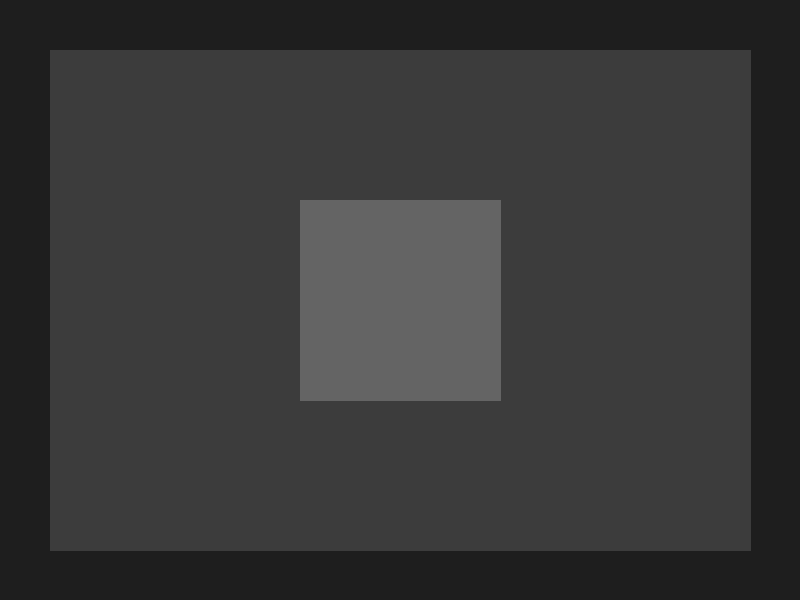

# Dundie - The Office Pixel Art Game

A top-down pixel art game inspired by "The Office" (NBC) where you play as Dwight Schrute and interact with your coworkers at Dunder Mifflin.



## Overview

Dundie is a 8/16-bit inspired game that lets you explore the Dunder Mifflin office and interact with characters from the TV show. The game features:

- Pixel art graphics inspired by classic SNES RPGs
- Character interactions with memorable quotes from the show
- Top-down exploration of the office space based on the show's floor plan

## Controls

- **Arrow Keys**: Move Dwight around the office
- **E**: Interact with characters or objects
- **Space**: Continue dialog

## Development

This game is built using Phaser 3, a popular HTML5 game framework.

### Prerequisites

- Node.js (v14 or higher)
- npm (v6 or higher)

### Installation

1. Clone the repository
2. Install dependencies:
   ```
   npm install
   ```

### Running the Game

To start the development server:

```
npm start
```

This will start a development server at http://localhost:8080.

### Building for Production

To build a production version:

```
npm run build
```

This will create a production-ready build in the `dist` directory.

## Credits

- Game development: Using Phaser 3 (https://phaser.io)
- Characters and storyline based on "The Office" (NBC) TV show
- Pixel art inspired by classic 8/16-bit era games

## License

This is a fan project created for educational purposes. "The Office" is a registered trademark of NBC Universal.
